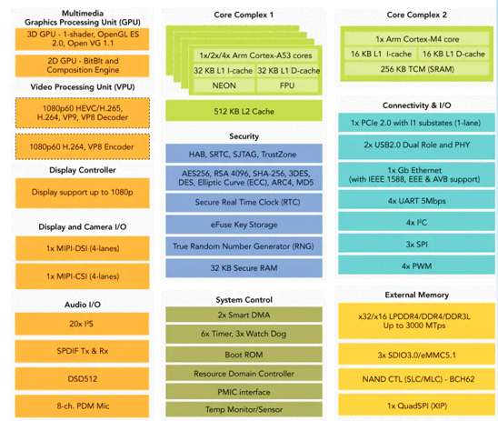
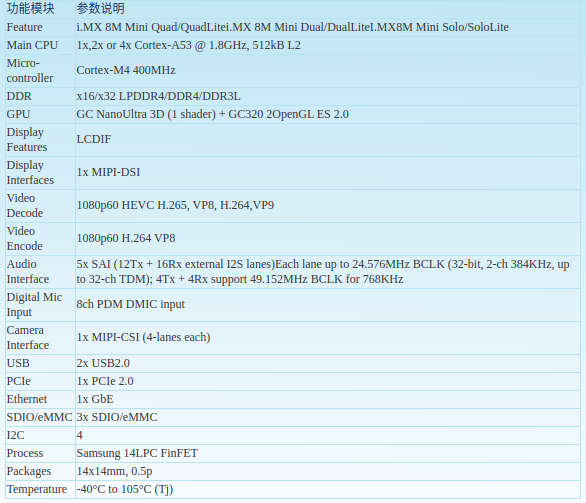

# nxp hardware组件

#### 简介
本仓库下完成了display针对于OpenHarmony render_service的实现，
用于显示的输出。sdma为iMX 8m平台DMA的固件，辅助进行Audio的实现。
G2D部分为iMX 8m mini硬件加速相关的代码，辅助display进行硬件合成
加速显示。usb为OpenHarmony要求定义USB role。本库相关代码可直接复
用于使用本iMX 8m mini的任何产品。

#### 软件架构
****

#### 软件架构说明
****

#### 安装教程
[参见board readme](https://gitee.com/openharmony-sig/device_board_osware/blob/master/imx8mm/README_zh.md)

#### 使用说明
[参见board readme](https://gitee.com/openharmony-sig/device_board_osware/blob/master/imx8mm/README_zh.md)

#### 目录
    .
    ├── common                            // 目前存放USB相关的配置文件
    │   └── hal
    │       └── usb
    ├── hardware
    │   ├── BUILD.gn
    │   ├── display                       // 目前存放render_service的适配代码
    │   │   ├── BUILD.gn
    │   │   ├── include
    │   │   └── src
    │   ├── g2d                           // 目前存放硬件加速的二进制内容及适配代码
    │   │   ├── BUILD.gn
    │   │   ├── include
    │   │   └── lib
    │   └── sdma
    │       ├── BUILD.gn
    │       └── sdma-imx7d.bin            // 目前存放DMA的firmware固件
    ├── imx8mm
    │   └── soc.gni
    ├── LICENSE
    ├── OAT.xml
    └── README.md

#### 约束
目前支持iMX 8m mini
#### 对应仓库

1.  device_soc_nxp/hardware/display
2.  device_soc_nxp/hardware/sdma
3.  device_soc_nxp/hardware/g2d
4.  device_soc_nxp/hardware/common/usb

## 相关仓库

* [vendor_osware](https://gitee.com/openharmony-sig/vendor_osware)

* [device_board_osware](https://gitee.com/openharmony-sig/device_board_osware)
